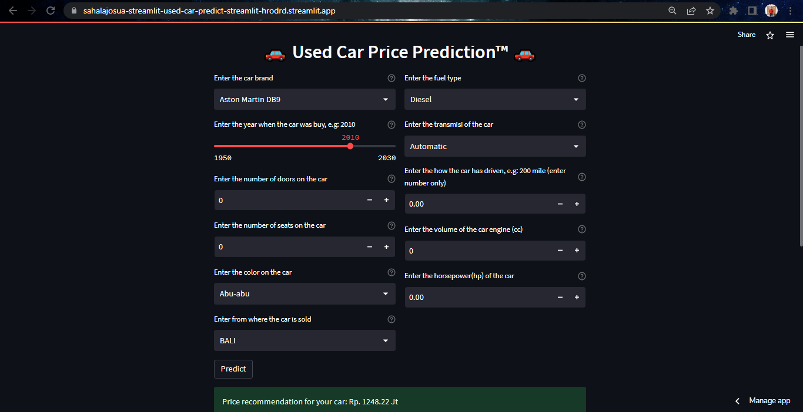

# Project Name
> Used cars have a very large market base. Many consider buying a Used Car instead of buying a new one, because it is worth it and a better investment.
The main reason for this huge market is when you buy a New Car and sell it another day without default, the price of the car is reduced by 30%.
There are also many scams on the market that not only sell wrongly but can also mislead the price.

## Table of Contents
* [General Info](#general-information)
* [Technologies Used](#technologies-used)
* [Visualization](#visualization)
* [Screenshots](#screenshots)
* [Setup](#setup)
* [Project Status](#project-status)
* [Room for Improvement](#room-for-improvement)
* [Acknowledgements](#acknowledgements)
* [Contact](#contact)

## General Information
- This project is about creating a tool to recommend used car prices in Indonesia. The data used is from web scraping and stored first in databases, data warehouses, data marts, and visualizing on the dashboard then creating a machine learning model to predict price recommendations for used cars.
- Not everyone understands how to put a price on a used car. Because not everyone understands automotive and prices on the market. This project is very useful for comparing market prices and recommending prices on used cars.
- The goal of this project is for users/viewers to understand the end-to-end data pipeline process to create machine learning models.
- I do this first to represent my learning results which are still far from good. Then I want this project to be useful for anyone who wants to learn about data and machine learning especially on the tools I've build.

## Technologies Used
- Python 
- Azure Cloud Database
- Tableau 
- Streamlit 

## Visualization
List the ready Data Visualization here:
- [_Viz-1_](https://public.tableau.com/app/profile/sahalajosuasinaga/viz/UsedCarsExecutiveOverview_sjsinaga/ExecutiveOverviewDashboard)
- [_Viz-2_](https://public.tableau.com/app/profile/sahalajosuasinaga/viz/UsedCarsExploratoryAnalysis_sjsinaga/ExploratoryDataAnalysis)
- [_Viz-3_](https://public.tableau.com/app/profile/sahalajosuasinaga/viz/UsedCarsDetailOverview_sjsinaga/DetailOverviewDashboard)

## Screenshots

## Setup
This project can be done on premise or in the cloud. But I'm working on it in Cloud Azure. I put the library I use in requirements.txt.

The steps I did in this project were:
1. Web scraping on the website www.mobil123.com to obtain the required data.
2. Save the scraped file in Blob Storage (you can save it anywhere).
3. Create a pipeline in Azure Data Factory for the ETL process (you can do this process on premise).
4. Create Data Warehouses and Data Marts.
5. Visualize in Tableau Public
6. Building the best machine learning models to recommend used car prices.

## Project Status
Project is: _Complete_

## Room for Improvement
Suggestions for this project.

Room for improvement:
- The data source for this project only comes from 1 table. There needs to be more data sources so as to facilitate the process of data engineering, and expand the exploration of data visualization.
- Add batch processing or stream processing to the data engineering section.
- There needs to be interaction between dashboards in data visualization.
- Because the value of a car depreciates every year, it is necessary to add other attributes to the machine learning model to calculate the depreciation value of the car.

## Acknowledgements
- Many thanks to [_G2Academy_](https://www.g2academy.co) for creating a bootcamp on Data Expert so I can make a project on what I've learned. Thanks to Mba Putri and Mas Nurul for being such great tutors in providing material and skills. I also thank my friends, Mas Farid and Mas Dias, who became friends for sharing this project. Moreover, I thank my brother who supported from the beginning to the completion of this project.

## Contact
Created by [@sahalajosua](https://www.linkedin.com/in/sahalajosuasinaga/) - feel free to contact me!
